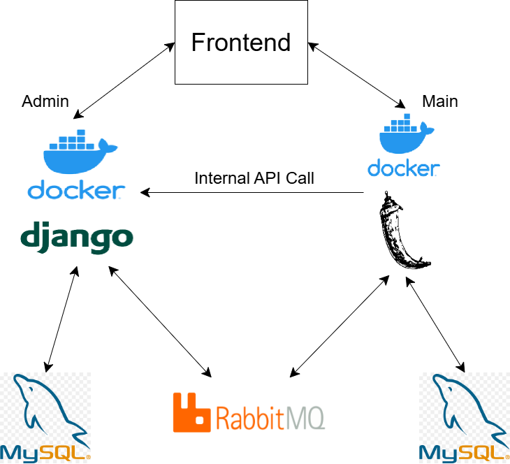

# Python Microservices

微服務架構專案，包含 Admin（Django）與 Main（Flask）兩個後端服務，透過 RabbitMQ 進行非同步通訊。

## 架構圖



## 專案結構

```
├── admin/          # Django 後端（管理、產品）
├── main/           # Flask 後端（主服務）
│   └── migrations/ # Alembic 資料庫遷移
├── architecture.py # 架構圖產生腳本
└── assets/         # 架構圖等靜態資源
```

## 服務說明

| 服務 | 技術 | 埠號 | 說明 |
|------|------|------|------|
| Admin | Django + MySQL | 8000, 33066 | 管理後台、產品 API |
| Main | Flask + MySQL | 8001, 33067 | 主服務 API |

兩服務皆透過 RabbitMQ 進行訊息佇列通訊。

## 快速啟動

### Admin

```bash
cd admin
docker-compose up -d
```

### Main

```bash
cd main
docker-compose up -d
```
