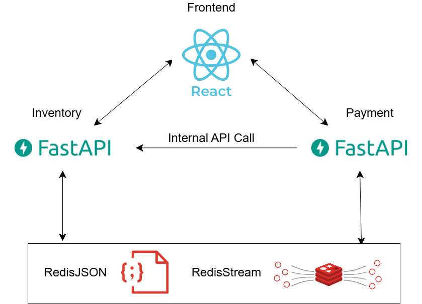

# FastAPI Redis Stream 微服務

微服務架構專案，包含 Inventory（庫存）與 Payment（訂單）兩個 FastAPI 後端服務，透過 Redis Stream 進行非同步事件通訊，並使用 RedisJSON 儲存資料。

## 架構圖



## 專案結構

```
├── inventory/           # 庫存服務（產品 CRUD、訂單完成消費）
├── payment/             # 訂單服務（建立訂單、退款消費）
├── inventory-frontend/   # React 前端
└── assets/              # 架構圖等靜態資源
```

## 服務說明

| 服務 | 技術 | 埠號 | 說明 |
|------|------|------|------|
| Inventory | FastAPI + Redis | 8000 | 產品 API、消費 `order_completed` 扣庫存 |
| Payment | FastAPI + Redis | 8001 | 訂單 API、消費 `refund_order` 更新退款狀態 |
| Frontend | React | 3000 | 產品與訂單操作介面 |

兩服務透過 Redis Stream 進行事件通訊：`order_completed`（訂單完成 → 扣庫存）、`refund_order`（庫存扣減失敗 → 退款）。

## 快速啟動

### Inventory

```bash
cd inventory
uvicorn main:app --reload --port 8000
# 另開終端執行 consumer
python consumer.py
```

### Payment

```bash
cd payment
uvicorn main:app --reload --port 8001
# 另開終端執行 consumer
python consumer.py
```

### Frontend

```bash
cd inventory-frontend
npm install
npm start
```
